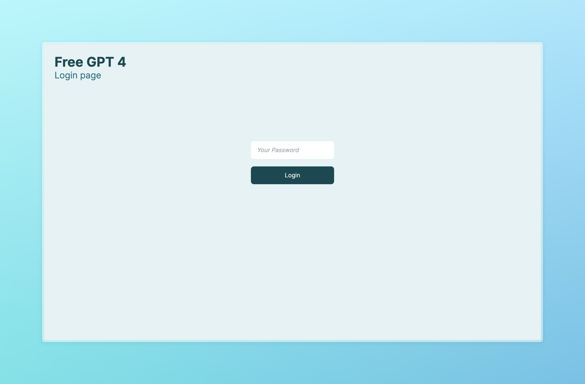
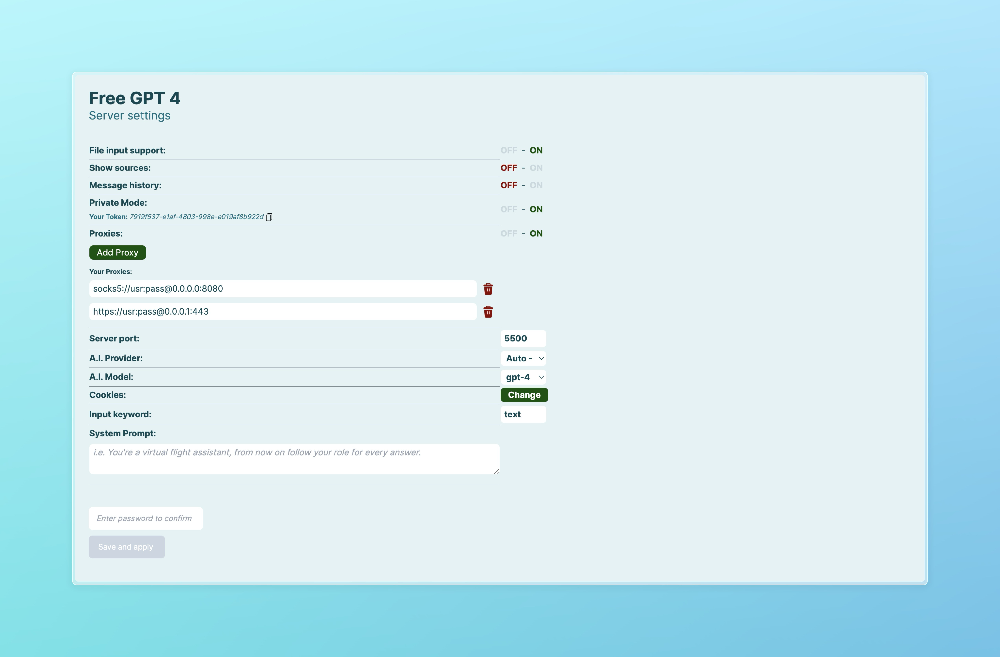

[](https://github.com/aledipa/Free-GPT4-WEB-API/actions/workflows/docker-image.yml)
[](https://github.com/aledipa/Free-GPT4-WEB-API/actions/workflows/python-app.yml)


# Free-GPT4-WEB-API

Self-hosted web API that exposes free, unlimited access to modern LLM providers through a single, simple HTTP interface. It includes an optional web GUI for configuration and supports running via Python or Docker.

## Key Features

- **Free to use** - No API keys or subscriptions required
- **Unlimited requests** - No rate limiting
- **Simple HTTP interface** - Returns plain text responses
- **Optional Web GUI** - Easy configuration through browser
- **Docker support** - Ready-to-use container available
- **Smart timeout handling** - Automatic retry with optimized timeouts

Note: The demo server, when available, can be overloaded and may not always respond.

---

## Table of contents

- Features
- Screenshots
- Quick start
  - Run with Docker
  - Run from source
- Usage
  - Quick examples (browser, curl, Python)
  - File input
  - Web GUI
- Command-line options
- Configuration
  - Cookies
  - Proxies
  - Models and providers
  - Private mode and password
- Siri integration
- Requirements
- Star history
- Contributing
- License

---

## Screenshots





---

## Quick start

### Option A: Run with Docker

Pull and run with an optional cookies.json and port mapping. In Docker, setting a GUI password is recommended (and required by some setups).

- Minimal (no cookies):
```
docker run -p 5500:5500 d0ckmg/free-gpt4-web-api:latest
```

- With cookies (read-only mount):
```
docker run \
  -v /path/to/your/cookies.json:/cookies.json:ro \
  -p 5500:5500 \
  d0ckmg/free-gpt4-web-api:latest
```

- Override container port mapping:
```
docker run -p YOUR_PORT:5500 d0ckmg/free-gpt4-web-api:latest
```

- docker-compose.yml:
```yaml
version: "3.9"
services:
  api:
    image: "d0ckmg/free-gpt4-web-api:latest"
    ports:
      - "YOUR_PORT:5500"
    #volumes:
    #  - /path/to/your/cookies.json:/cookies.json:ro
```

Note:
- If you plan to use the Web GUI in Docker, set a password (see “Command-line options”).
- The API listens on port 5500 in the container.

### Option B: Run from source

1. Clone the repo
```
git clone https://github.com/aledipa/Free-GPT4-WEB-API.git
cd Free-GPT4-WEB-API
```

2. Install dependencies
```
pip install -r requirements.txt
```

3. Start the server (basic)
```bash
python3 src/FreeGPT4_Server.py
```

### Security Note

When using the Web GUI, always set a secure password:
```bash
python3 src/FreeGPT4_Server.py --enable-gui --password your_secure_password
```

---

## Usage

The API returns plain text by default.

- Quick browser test:
  - Start the server
  - Open: http://127.0.0.1:5500/?text=Hello

Examples:
- GET http://127.0.0.1:5500/?text=Write%20a%20haiku
- If you changed the keyword parameter (see `--keyword`), replace `text` with your chosen keyword.

### curl examples

- Simple text prompt:
```
curl "http://127.0.0.1:5500/?text=Explain%20quicksort%20in%20simple%20terms"
```

- File input (see `--file-input` in options):
```
fileTMP="$1"
curl -s -F file=@"${fileTMP}" http://127.0.0.1:5500/
```

### Python example

```python
import requests

resp = requests.get("http://127.0.0.1:5500/", params={"text": "Give me a limerick"})
print(resp.text)
```

### Web GUI

- Start with GUI enabled:
```
python3 FreeGPT4_Server.py --enable-gui
```

- Open settings or login:
  - http://127.0.0.1:5500/settings
  - http://127.0.0.1:5500/login

From the GUI you can configure common options (e.g., model, provider, keyword, history, cookies).

---

## Command-line options

Show help:
```bash
python3 src/FreeGPT4_Server.py [-h] [--remove-sources] [--enable-gui]
                                [--private-mode] [--enable-history] [--password PASSWORD]
                                [--cookie-file COOKIE_FILE] [--file-input] [--port PORT]
                                [--model MODEL] [--provider PROVIDER] [--keyword KEYWORD]
                                [--system-prompt SYSTEM_PROMPT] [--enable-proxies] [--enable-virtual-users]
```

Options:
- -h, --help                 Show help and exit
- --remove-sources           Remove sources from responses
- --enable-gui               Enable graphical settings interface
- --private-mode             Require a private token to access the API
- --enable-history           Enable message history
- --password PASSWORD        Set/change the password for the settings page
  - Note: Mandatory in some Docker environments
- --cookie-file COOKIE_FILE  Use a cookie file (e.g., /cookies.json)
- --file-input               Enable file-as-input support (see curl example)
- --port PORT                HTTP port (default: 5500)
- --model MODEL              Model to use (default: gpt-4)
- --provider PROVIDER        Provider to use (default: Bing)
- --keyword KEYWORD          Change input query keyword (default: text)
- --system-prompt SYSTEM_PROMPT
                             System prompt to steer answers
- --enable-proxies           Use one or more proxies to reduce blocking
- --enable-virtual-users
                             Enable virtual users to divide requests among multiple users

---

## Configuration

### Cookies

Some providers require cookies to work properly. For the Bing model, only the “_U” cookie is needed.

- Passing cookies via file:
  - Use `--cookie-file /cookies.json` when running from source
  - In Docker, mount your cookies file read-only: `-v /path/to/cookies.json:/cookies.json:ro`
- The GUI also exposes cookie-related settings.

### Proxies

Enable proxies to mitigate blocks:
- Start with `--enable-proxies`
- Ensure your environment is configured for aiohttp/aiohttp_socks if you need SOCKS/HTTP proxies.

### Models and providers

- **Models**: gpt-4, gpt-4o, deepseek-r1, and other modern LLMs
- **Default model**: `gpt-4`
- **Default provider**: `DuckDuckGo` (reliable fallback)
- **Provider Fallback**: Automatic switching between Bing, DuckDuckGo, and other providers
- **Health Monitoring**: Real-time provider status tracking

Change via flags or in the GUI:
```bash
--model gpt-4o --provider Bing
```

### Reliability Features

- **Smart Timeout Handling**: Optimized 30-second timeouts with automatic retry
- **Provider Fallback**: Automatic switching when primary provider fails
- **Health Monitoring**: Continuous provider status tracking
- **Blacklist System**: Automatic exclusion of problematic providers

### Private mode and password

- `--private-mode` requires a private token to access the API
- `--password` protects the settings page (**mandatory in Docker setups**)
- **Security Enhancement**: Authentication system hardened against bypass attacks
- **Logging**: All authentication attempts are logged for security monitoring
- Use a strong password if you expose the API beyond localhost

**Important**: Always set a password when using the Web GUI to prevent unauthorized access.

---

## Siri integration


Use the GPTMode Apple Shortcut to ask your self-hosted API via Siri.

Shortcut:
- https://www.icloud.com/shortcuts/bfeed30555854958bd6165fa4d82e21b

Say “GPT Mode” to Siri and ask your question when prompted.

---

## Requirements

- Python 3.8+
- Flask[async]
- g4f (from https://github.com/xtekky/gpt4free)
- aiohttp
- aiohttp_socks
- Werkzeug
- requests (for enhanced HTTP handling)

For development and testing:
- pytest
- pytest-asyncio

## Troubleshooting

### Common Issues

1. **Timeout Errors**: The system now automatically retries with fallback providers
2. **Provider Blocks**: Health monitoring automatically switches to working providers
3. **Authentication Issues**: Ensure you set a strong password and check logs for failed attempts
4. **Docker Permission Issues**: Use read-only mounts for sensitive files like cookies.json

### Getting Help

If you encounter issues:
1. Check the application logs for detailed error information
2. Verify your provider configuration in the Web GUI
3. Ensure cookies are properly formatted (if using)
4. Try different providers through the fallback system

---

## Star history

[](https://star-history.com/#aledipa/Free-GPT4-WEB-API&Date)

---

## Contributing

Contributions are welcome! Feel free to open issues and pull requests to improve features, docs, or reliability.

---

## License

GNU General Public License v3.0

See LICENSE for details.